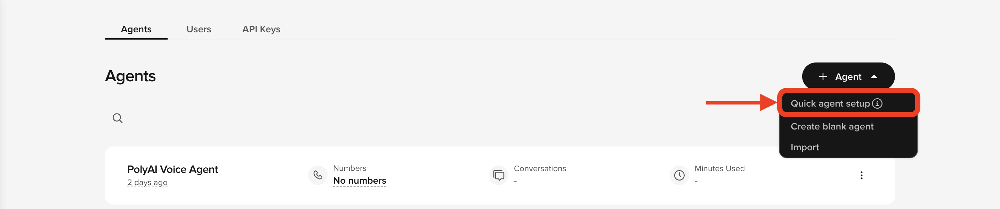
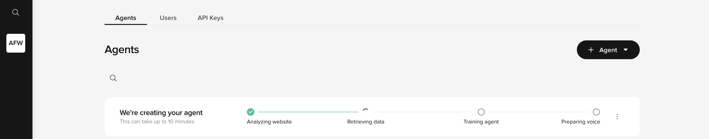
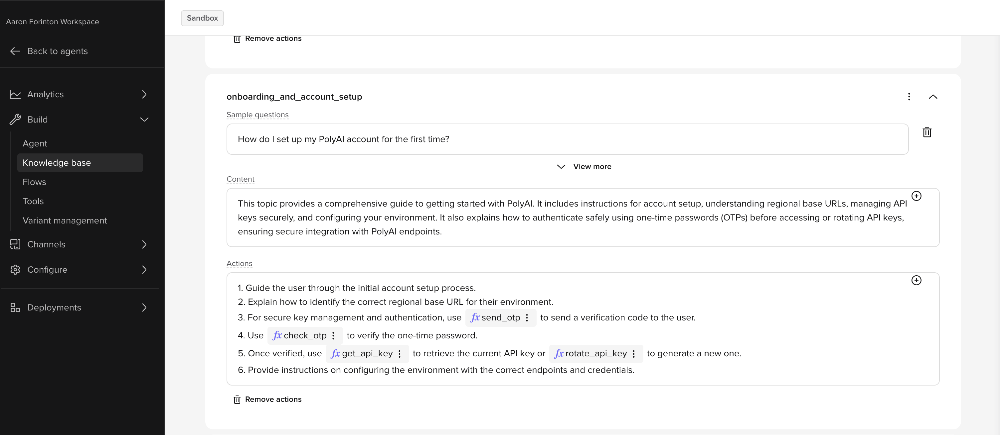

# Not sure where to start?

If you do not yet have an agent in Agent Studio, or you want a working starting point before setting up the ADK, you can build a personalized agent from your company website in a few minutes — no configuration required. The agent lives in Agent Studio as a normal project, so you can pull it straight into the ADK and continue development locally as soon as it is ready.

---

## New to PolyAI — build your first agent

If you do not yet have access to Agent Studio or an existing agent, start here.

### Step 1 — Install the ADK

Follow the [Installation](./installation.md) guide to install the ADK and its prerequisites. Once installed, come back here to set up your account.

### Step 2 — Run `poly start`

```bash
poly start
```

`poly start` handles signup, API key generation, and project creation in a single command:

1. Opens a browser for you to **create an Agent Studio account** (or sign in to an existing one). This can be on any device — it does not have to be the machine running the CLI.
2. Once authenticated, it **generates an API key** and saves it to `~/.poly/credentials.json` so future `poly` commands authenticate automatically.
3. Optionally **creates a new project** in Agent Studio and initializes it locally.

!!! tip "Already have an account?"
    If you already have an API key set (via the credential file or an environment variable), `poly start` detects it and skips straight to project creation.

### Step 3 — Create an agent from your website



Once you are inside Agent Studio:

1. Click the **+ Agent** button in the top-right corner.
2. Select **Quick Agent Setup** from the dropdown.
3. Enter your company website URL and click **Create agent**.

Agent Studio crawls your website and generates a working agent configuration — usually within a few minutes. Before it builds, you can choose the voice your agent will use.



!!! tip "What gets generated"

    Agent Studio populates **topics** (knowledge base entries) and basic **agent settings** (personality, role, rules) from your website's public content. This gives you an agent that knows about your company and can answer questions — but it does not generate flows, variants, entities, handoffs, or integrations. Those are for you to build locally with the ADK. Everything that is generated is standard ADK-compatible configuration and fully editable once pulled down.

### Step 4 — Test your agent in Agent Studio



Once the agent is ready, test it inside Agent Studio to confirm it's filled in with information as expected. This gives you a working baseline before you move to local development.

### Step 5 — Pull the agent into the ADK

If `poly start` already created and initialized a project for you, skip this step. Otherwise, link your local folder to the project:

```bash
poly init
```

[`poly init`](../reference/cli.md#poly-init) walks you through interactive dropdowns to pick a region, account, and project. It creates a subdirectory and pulls the configuration automatically. Change into the project directory before running any further commands. See [First commands](./first-commands.md) for the full walkthrough.

You now have a fully editable local copy of your agent.

### Step 6 — Continue with the ADK

From here, the standard ADK workflow applies. You can:

- edit resources locally with any tooling
- create branches with `poly branch create`
- track changes with `poly status` and `poly diff`
- validate and push changes back with `poly push`

<div class="grid cards" markdown>

-   **Build an agent with the ADK**

    ---

    Follow the full step-by-step workflow for local development.
    [Open the tutorial](../tutorials/build-an-agent.md)

</div>

---

## Already have an agent in Agent Studio?

If you already have an agent in Agent Studio — built in the browser editor, by a PolyAI team, or using any other method — you can connect it directly to the ADK. The ADK connects to any existing Agent Studio project using the same `poly init` + `poly pull` workflow described above.

1. Complete [Prerequisites](./prerequisites.md) to install local tools.
2. Follow [Installation](./installation.md) to install the ADK.
3. Run `poly start` to sign in and save your API key, or set it manually (see [Prerequisites — API key](./prerequisites.md#authenticate-with-an-api-key)).
4. Run:

    ```bash
    poly init
    ```

    `poly init` shows interactive dropdowns to pick your project. See [First commands](./first-commands.md) for details.

Your local folder will mirror the project in Agent Studio and you can begin editing immediately.

---

## Next step

Install the ADK and confirm your local tools are in place before running your first commands.

<div class="grid cards" markdown>

-   **Installation**

    ---

    Install the ADK and set up your local environment.
    [Open installation](./installation.md)

-   **What is the ADK?**

    ---

    Understand what the ADK does and how it fits into the Agent Studio workflow.
    [Read the overview](./what-is-the-adk.md)

</div>
