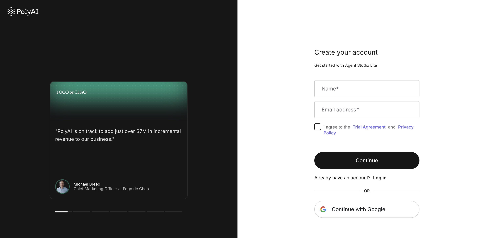
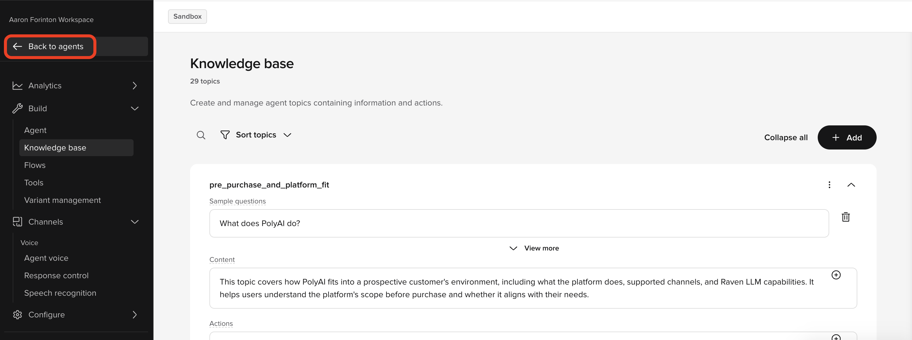

# Not sure where to start?

If you do not yet have an agent in Agent Studio, or if you are feeling stuck before diving into local development, you can build a personalized agent from your company website in a few minutes — no configuration required. The agent lives in Agent Studio as a normal project, which means you can pull it straight into the ADK and continue development locally the moment it is ready.

---

## New to PolyAI — build your first agent

If you do not yet have access to Agent Studio or an existing agent, start here.

### Step 1 — Get access to Agent Studio

Go to [studio.poly.ai](https://studio.poly.ai){ target="_blank" rel="noopener" } and sign up. You can sign up with your email or log in with SSO.



### Step 2 — Create an agent from your website


Once you are inside Agent Studio:

1. Click the **+ Agent** button in the top-right corner.
2. Select **Quick Agent Setup** from the dropdown.
3. Enter your company website URL and click **Create agent**.

Agent Studio crawls your website and generates a working agent configuration — usually within a few minutes. Before it builds, you can choose the voice your agent will use.


!!! tip "What gets generated"

    Agent Studio populates **topics** (knowledge base entries) and basic **agent settings** (personality, role, rules) from your website's public content. This gives you an agent that knows about your company and can answer questions — but it does not generate flows, variants, entities, handoffs, or integrations. Those are for you to build locally with the ADK. Everything that is generated is standard ADK-compatible configuration and fully editable once pulled down.

### Step 3 — Test your agent in Agent Studio


Once the agent is ready, test it inside Agent Studio to confirm it's filled in with information as expected. This gives you a working baseline before you move to local development.

### Step 4 — Find your account and project IDs

To pull the agent into the ADK, you need two identifiers from Agent Studio. You can find them in the URL when your project is open:

~~~
https://studio.poly.ai/<account_id>/<project_id>/...
~~~

Copy both values — you will need them in the next step.

### Step 5 — Generate an API key



The ADK uses an API key to authenticate with Agent Studio. Click **Back to agents** to return to your **workspace**, open the **API Keys** tab (next to the **Users** tab) and click **+ API key** to generate one.


Then set it as an environment variable:

~~~bash
export POLY_ADK_KEY=<your-api-key>
~~~

To make it permanent, add the export line to your shell profile (`~/.zshrc` or `~/.bashrc`).

### Step 6 — Pull the agent into the ADK

Once the [ADK is installed](./installation.md), link your local folder to the project and pull its configuration down:

```bash
poly init --account_id <account_id> --project_id <project_id>
poly pull
```

[`poly init`](../reference/cli.md#poly-init) creates a subdirectory at `{account_id}/{project_id}` inside your current directory, then pulls the current configuration automatically. [`poly pull`](../reference/cli.md#poly-pull) can be used to refresh it at any time. Change into the project directory before running any further commands.

You now have a fully editable local copy of your agent.

### Step 7 — Continue with the ADK

From here, the standard ADK workflow applies. You can:

- edit resources locally with any tooling
- create branches with `poly branch create`
- track changes with `poly status` and `poly diff`
- validate and push changes back with `poly push`

<div class="grid cards" markdown>

-   **Build an agent with the ADK**

    ---

    Follow the full step-by-step workflow for local development.
    [Open the tutorial](../tutorials/build-an-agent.md)

</div>

---

## Already have an agent in Agent Studio?

If you already have an agent in Agent Studio — built in the browser editor, by a PolyAI team, or using any other method — you can connect it directly to the ADK. The ADK connects to any existing Agent Studio project using the same `poly init` + `poly pull` workflow described above.

1. Complete [Prerequisites](./prerequisites.md) to generate your API key and install local tools.
2. Follow [Installation](./installation.md) to install the ADK.
3. Find your `account_id` and `project_id` in the Agent Studio URL.
4. Run:

    ~~~bash
    poly init --account_id <account_id> --project_id <project_id>
    poly pull
    ~~~

Your local folder will mirror the project in Agent Studio and you can begin editing immediately.

---

## Next step

Install the ADK and confirm your local tools are in place before running your first commands.

<div class="grid cards" markdown>

-   **Installation**

    ---

    Install the ADK and set up your local environment.
    [Open installation](./installation.md)

-   **What is the ADK?**

    ---

    Understand what the ADK does and how it fits into the Agent Studio workflow.
    [Read the overview](./what-is-the-adk.md)

</div>
