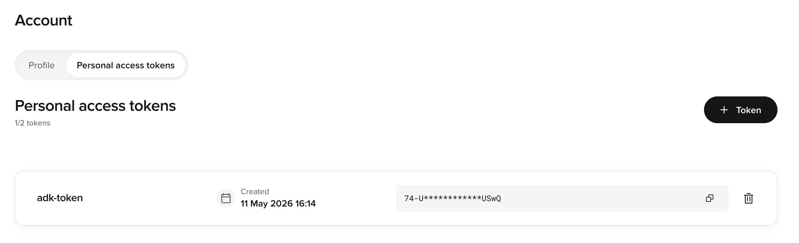

# Getting started

Two steps — install the ADK, then run `poly setup` — take you from an empty machine to a local project you can edit, push, and deploy.

---

## Step 1 — Install the ADK

It is recommended to use **uv** to manage the Python environment. If you already have it, skip the first line.

```bash
curl -LsSf https://astral.sh/uv/install.sh | sh   # or: brew install uv
```

Then install the ADK as a tool:

```bash
uv tool install polyai-adk
```

Confirm it worked:

```bash
poly --help
```

!!! tip "Optional — install the VS Code / Cursor extension"

    If you plan to work in **VS Code** or **Cursor**, you can also install the [PolyAI ADK extension](../tooling/tooling.md#polyai-adk-extension-for-vs-code-and-cursor) for resource-aware editing on top of the CLI. The extension is additive — the `poly` command remains the source of truth for every workflow.

## Step 2 — Run `poly setup`

One command handles the rest of onboarding:

```bash
poly setup
```

It runs four steps, skipping any that are already done — so it is safe to re-run at any time:

1. **Sign in** — opens a browser window, fetches (or creates) an API key for your user, and saves it to `~/.poly/credentials.json` so future `poly` commands pick it up automatically — no environment variables to manage. The browser step can happen on any device, not just the machine running the CLI.
2. **Shell completion** — installs tab completion for bash, zsh, or fish.
3. **AI agent skills** — installs the ADK's skills into coding agents detected on your machine (Claude Code, Cursor, Codex, and others), so they know the `poly` workflow. Requires Node.js 18+ and is skipped with a warning otherwise.
4. **Project** — offers to create a new Agent Studio project or connect an existing one, covered in Step 3 below.

You are asked to pick a region when signing in. Choose based on your account type:

| Region | Account type |
|---|---|
| `studio` | Self-serve — signed up at [studio.poly.ai](https://studio.poly.ai) |
| `us-1`, `euw-1`, `uk-1` | Enterprise — a workspace provisioned by PolyAI |

To skip the prompt, pass the region directly:

```bash
poly setup --region studio   # or us-1, euw-1, uk-1
```

If you're not sure which account type you have, your PolyAI contact can confirm.

!!! warning "Creating an account"
    Only self-serve accounts can be created through the sign-in flow. Enterprise clusters are provisioned by PolyAI — if you need an enterprise workspace, get in touch with your PolyAI contact.

See [`poly setup`](../reference/cli/setup.md) for the flags that skip or target individual steps.

### Sign in only — `poly login`

To set up credentials without the rest, `poly login` runs the sign-in step on its own:

```bash
poly login
poly login --region us-1
```

To sign in to more than one region from the same machine, re-run `poly login` for each — the credential file stores them side by side.

### Manual API key export { #manual-api-key-export }

If you would rather store your credentials in an environment variable - in a CI for example - create the key yourself in the Agent Studio UI:

1. Log in to Agent Studio and go to your account.
2. In the **Personal Access Token** tab (next to the **Profile** tab), click **+ Token**.



Then export the key:

```bash
export POLY_ADK_KEY=<your-api-key>
```

To make it permanent, add the export line to your shell profile (`~/.zshrc` or `~/.bashrc`).

### Per-region API keys

If you work across multiple regions, you can set region-scoped environment variables. The ADK checks the credential file first, then region-scoped env vars, then `POLY_ADK_KEY`.

| Region | Environment variable |
|---|---|
| `us-1` | `POLY_ADK_KEY_US` |
| `euw-1` | `POLY_ADK_KEY_EUW` |
| `uk-1` | `POLY_ADK_KEY_UK` |
| `studio` | `POLY_ADK_KEY_STUDIO` |

```bash
export POLY_ADK_KEY_US=<your-us-api-key>
export POLY_ADK_KEY=<your-fallback-api-key>   # used for any other region
```

!!! info "How the ADK resolves API keys"
    The ADK checks for credentials in the following order:

    1. **Credential file** — `~/.poly/credentials.json` (written by `poly setup` or `poly login`)
    2. **Region-specific env var** — e.g. `POLY_ADK_KEY_US`
    3. **General env var** — `POLY_ADK_KEY`

    The first match wins. If nothing is found, the CLI raises an error.

!!! tip "Workspace scoped API keys"
    Credentials from `poly login` are Personal Access Tokens and are user-scoped. If you would rather use a workspace-scoped API key, look for the API keys tab in your workspace settings.

## Step 3 — Create or connect a project

`poly setup` offers this as its final step. To do it separately, or to add more projects later — to create a new Agent Studio project and pull it down locally:

```bash
poly project create
```

To connect an existing project:

```bash
poly init
```

[`poly init`](../reference/cli/init.md) walks you through interactive dropdowns to pick a region, account, and project, then pulls the configuration locally.

Either command places the project in a directory named after your account and project IDs:

```bash
cd <account_id>/<project_id>
```

From inside your project directory, the core workflow is:

```bash
poly status              # see what's changed
poly diff                # inspect changes in detail
poly branch create dev   # work on a branch
poly push                # push changes to Agent Studio
poly chat                # talk to your agent
poly branch merge        # merge branch back into main
```

Edit flows, functions, topics, and other resources in your editor of choice — they're just YAML and Python files. Push when you're ready to test in Agent Studio.

---

## Start an agent from a template

If you want a pre-built starting point, `poly template` lets you browse and load one.

```bash
poly template list          # see available templates
poly template load          # opens a picker
poly template load <name>   # load a specific template
```

You can also load a template when you first create a project — `poly project create` offers it once the project exists.

!!! warning "Loading a template overwrites local resources"
    `poly template load` replaces your local project resources with the template contents. Push or back up any local work you want to keep before loading.

---

## Next steps

<div class="grid cards" markdown>

-   **Watch the walkthrough**

    ---

    See a practical demonstration of the ADK in use.
    [Open the walkthrough video](./walkthrough-video.md)

-   **Build an agent with the ADK**

    ---

    Follow the full step-by-step tutorial for local development.
    [Open the tutorial](../tutorials/build-an-agent.md)

-   **CLI reference**

    ---

    Explore the full set of `poly` commands and their flags.
    [Open CLI reference](../reference/cli.md)

</div>
