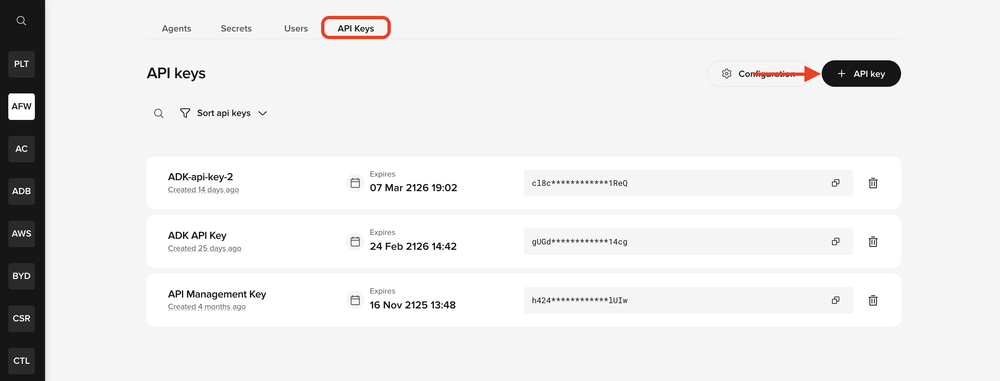

If you haven't already, start with the [Getting started](./get-started.md) page for an overview of what the ADK is and how to sign up for Agent Studio. If you run into any issues generating your API key, contact [developers@poly-ai.com](mailto:developers@poly-ai.com).

Before using the **PolyAI ADK**, you need the correct **platform access** and the required **local tools**.

## Authenticate with an API key

The ADK needs an API key to communicate with Agent Studio. There are two ways to set one up:

### Option A — `poly start` (recommended)

If you are new to PolyAI, run `poly start` after [installing the ADK](./installation.md). It handles account creation, API key generation, and credential storage in one step. The key is saved to `~/.poly/credentials.json` automatically — no manual export needed.

### Option B — Manual setup

If you already have an Agent Studio account, you can generate and export a key manually:

1. Log in to Agent Studio and open your workspace.
2. In the **API Keys** tab (next to the **Users** tab), click **+ API key** in the top right.



Then set it as an environment variable:

```bash
export POLY_ADK_KEY=<your-api-key>
```

To make it permanent, add the export line to your shell profile (for example, `~/.zshrc` or `~/.bashrc`).

!!! info "How the ADK resolves API keys"
    The ADK checks for credentials in the following order:

    1. **Credential file** — `~/.poly/credentials.json` (written by `poly start`)
    2. **Region-specific env var** — e.g. `POLY_ADK_KEY_US` (see [per-region keys](./installation.md#per-region-api-keys))
    3. **General env var** — `POLY_ADK_KEY`

    The first match wins. If nothing is found, the CLI raises an error.

!!! warning "API keys are workspace-scoped"
    An API key grants access to one specific Agent Studio workspace. When you run `poly init`, it lists all projects visible to that key. If you see many projects that do not look like yours, you are likely using a key scoped to the wrong workspace — for example, an organization-wide key rather than one scoped to your personal workspace. Contact your PolyAI contact to confirm you have a key for the correct workspace.

## Local requirements

Install the following tools before continuing:

| Tool | Version | Notes |
|---|---|---|
| **uv** | latest | Manages Python and virtual environments |
| **Git** | any | Optional — recommended for version control of your local project files |

### Install uv

`uv` manages Python versions for you, including the version required by the ADK. Install it with:

```bash
curl -LsSf https://astral.sh/uv/install.sh | sh
```

Alternatively, with Homebrew on macOS:

```bash
brew install uv
```

See the [uv installation guide](https://docs.astral.sh/uv/getting-started/installation/){ target="_blank" rel="noopener" } for more options.

## Checklist

Before continuing, confirm:

- You have an **API key** — either saved by `poly start` or exported manually
- `uv` is installed

## Next step

Once these requirements are in place, continue to installation.

<div class="grid cards" markdown>

-   **Installation**

    ---

    Install the ADK and set up your local environment.
    [Open installation](./installation.md)

</div>
